# Android Chat Application

A real-time chat application built with Android and Firebase. This app allows users to create profiles, find other users, and engage in one-on-one conversations with message history and real-time updates.

---

## Features

### User Authentication
- Email-based sign up and sign in
- Profile picture upload
- Secure password management

### Real-time Messaging
- One-on-one chat functionality
- Real-time message delivery
- Message timestamps
- Chat history preservation

### User Interface
- Clean and intuitive chat interface
- User list with profile pictures
- Online/offline status indicators
- Profile image support

### Data Management
- Firebase Cloud Firestore for data storage
- Firebase Cloud Messaging for push notifications
- Local data persistence
- Efficient image encoding and storage

---

## Technical Details

### Architecture & Components

#### Activities
- **MainActivity**: Main user interface and navigation hub
- **ChatActivity**: Handles one-on-one chat interactions
- **SignInActivity**: Manages user authentication
- **SignUpActivity**: Handles new user registration
- **UserActivity**: Displays available chat users

#### Adapters
- **ChatAdapter**: Manages chat message display
- **UsersAdapter**: Handles user list display

#### Models
- **User**: User profile data model
- **ChatMessage**: Message data model

#### Utilities
- **PreferenceManager**: Handles local data storage
- **Constants**: Application-wide constant values

---

## Prerequisites

- Android Studio Arctic Fox or later
- Android SDK 21 or higher
- Google Play Services
- Firebase Account and Project Setup

---

## Dependencies

Some Gradle dependencies:
```groovy
dependencies {
    implementation 'com.google.firebase:firebase-auth:21.3.0'
    implementation 'com.google.firebase:firebase-firestore:24.5.0'
    implementation 'androidx.appcompat:appcompat:1.6.1'
}

app/
├── manifests/
│   └── AndroidManifest.xml
├── java/
│   └── com.example.cslab4/
│       ├── activities/
│       │   ├── ChatActivity.java
│       │   ├── MainActivity.java
│       │   ├── SignInActivity.java
│       │   ├── SignUpActivity.java
│       │   └── UserActivity.java
│       ├── adapters/
│       │   ├── ChatAdapter.java
│       │   └── UsersAdapter.java
│       ├── firebase/
│       │   └── MessagingService.java
│       ├── listeners/
│       │   └── UserListener.java
│       ├── models/
│       │   ├── ChatMessage.java
│       │   └── User.java
│       └── utilities/
│           ├── Constants.java
│           └── PreferenceManager.java
├── res/
│   ├── drawable/
│   ├── layout/
│   ├── mipmap/
│   ├── values/
│   │   ├── colors.xml
│   │   ├── strings.xml
│   │   └── themes.xml
│   └── xml/
└── build.gradle.kts

# Screenshots

Here are some screenshots showcasing the functionality and design of the application:

---

### 1. Chat View - User 1 Perspective
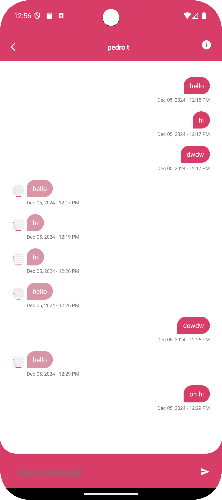

---

### 2. Chat View - User 2 Perspective
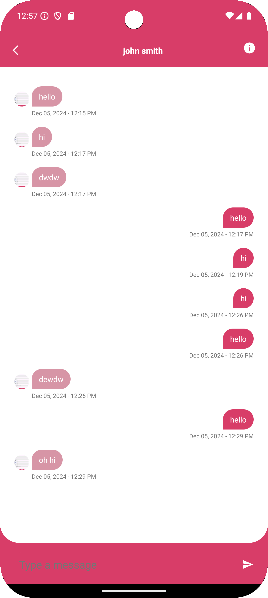

---

### 3. Custom Icon Implementation
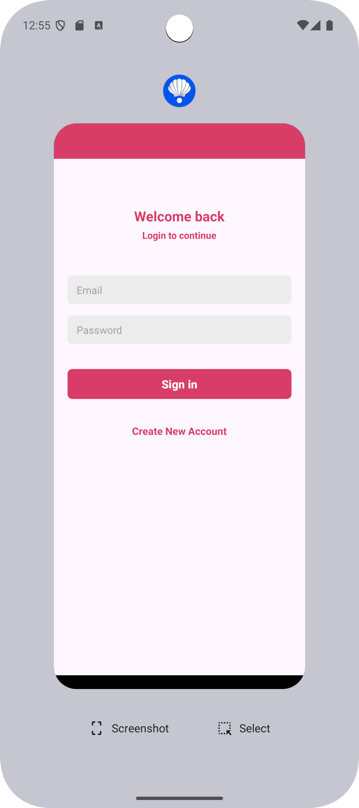

---

### 4. Firebase Chat Entry
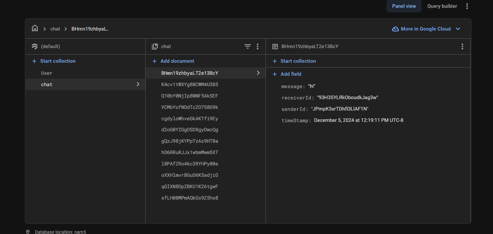

---

### 5. Firebase User Entry
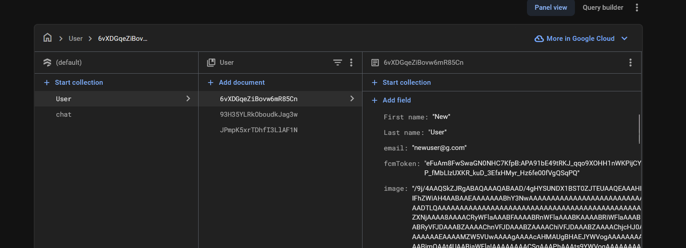

---

### 6. Home Page
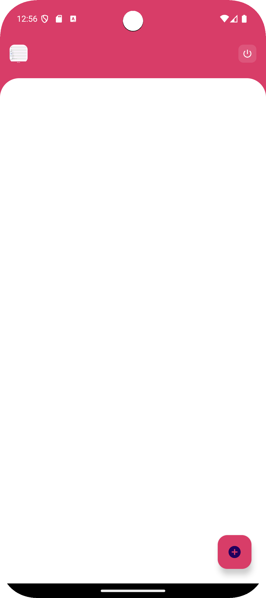

---

### 7. New User Successful Login
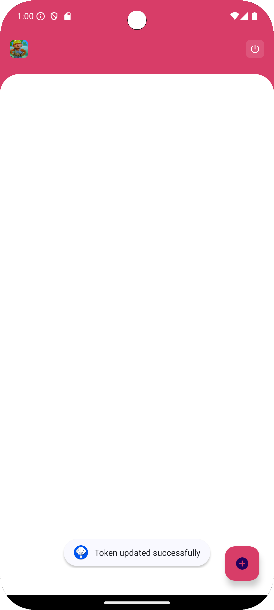

---

### 8. Profile Creation
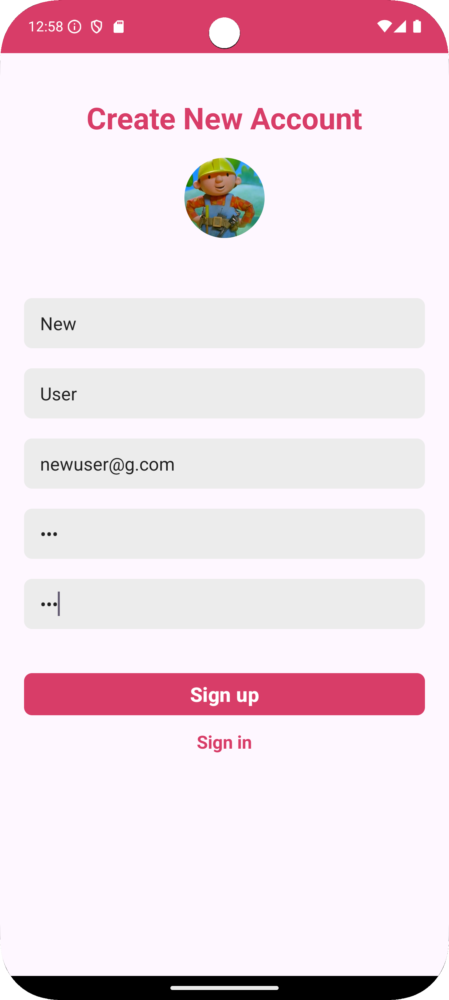

---

### 9. Sign Out Toast
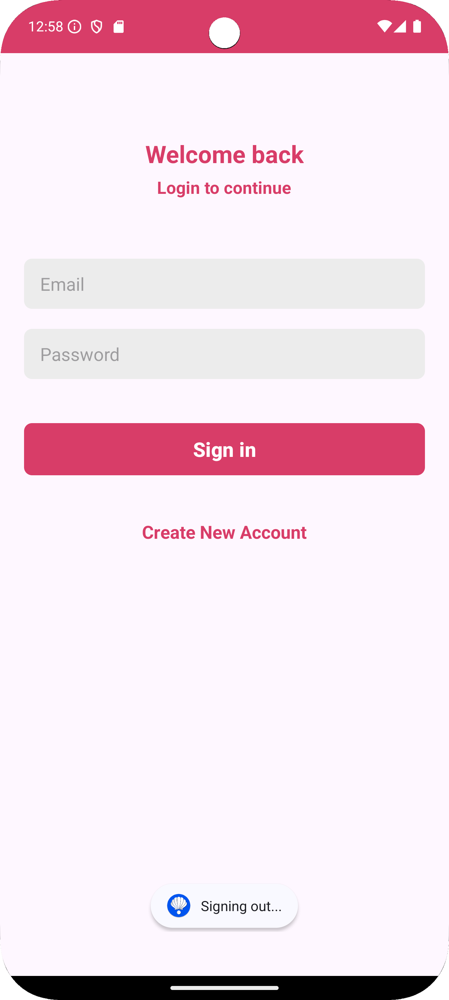

---

### 10. Text Message Field
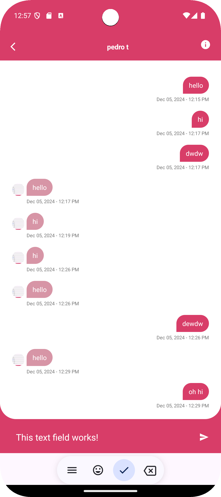

---

### 11. Text Message Functionality
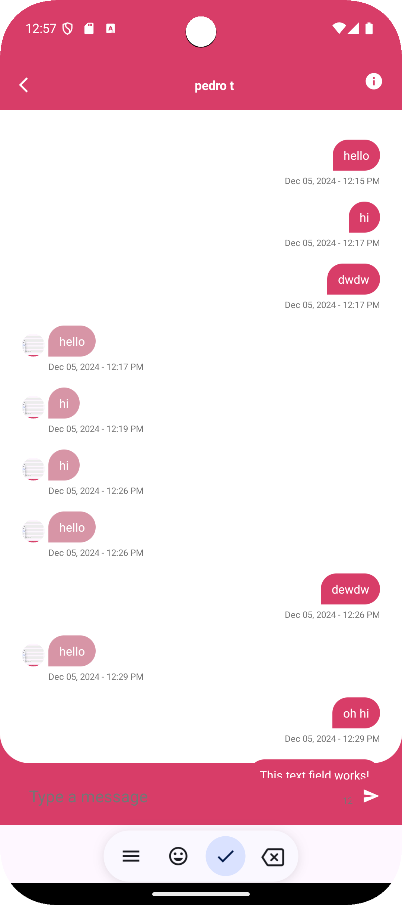

---

### 12. User List
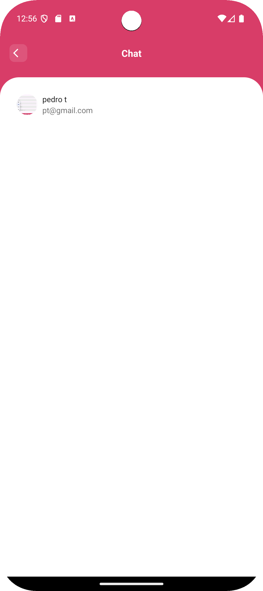
